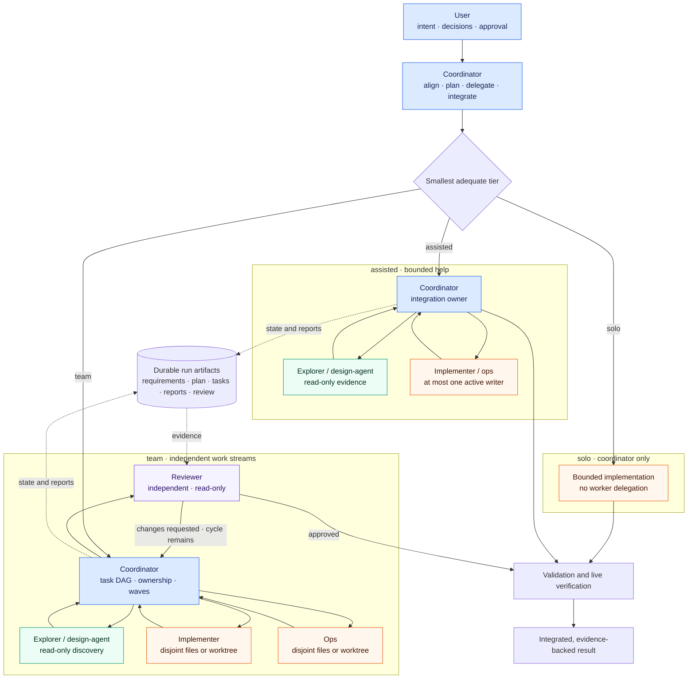

# agent-team

[](https://github.com/dearrrfish/agent-team/actions/workflows/ci.yml)

`agent-team` generates portable, role-based agent teams for Codex, with
experimental adapters for Claude Code and Antigravity CLI. It gives each client
the same workflow contract while rendering the native agent and skill files that
client expects.

The project is designed for coding work that benefits from explicit ownership:
a coordinator plans and integrates, bounded workers execute independent tasks,
and a read-only reviewer checks the result. Adaptive workflow tiers keep that
coordination overhead out of small changes.

> [!NOTE]
> `agent-team` is a generator, validator, and installer—not a cross-client
> orchestrator. Codex, Claude Code, and Antigravity each run their own native
> subagents after installation.

Linux users can run or install via Nix flakes. macOS users can install via
Homebrew (`brew install dearrrfish/agent-team/agent-team`) or use the
documented repository-source workflow below. There is no PyPI release or
Darwin Nix package.

## What it provides

- Six target-neutral roles: `coordinator`, `explorer`, `design-agent`,
  `implementer`, `ops`, and `reviewer`.
- Three workload tiers: lightweight `solo`, bounded `assisted`, and reviewed
  `team` execution.
- Cost/quality routing through `economy`, `balanced`, and `quality` model
  presets for every adapter.
- Durable requirements, plans, task DAGs, decisions, worker reports, reviews,
  and final reports when the selected tier requires them.
- Strict TOML, lifecycle, task dependency, report, review, and template
  validation.
- Deterministic rendering plus preview-first installation with ownership hashes,
  drift detection, atomic writes, and backups.

## Agent-team topology and ideology

The topology scales outward only when the task benefits from delegation. The
user retains product decisions, the coordinator remains the single integration
authority, and workers receive bounded roles rather than sharing ownership of
the whole task.



This structure encodes seven operating principles:

1. **User authority:** material product, scope, and risk decisions stay with the
   user.
2. **Coordinator ownership:** one main-thread coordinator owns delegation,
   integration, state transitions, and completion.
3. **Minimum sufficient team:** `solo` is the baseline; `assisted` and `team`
   must earn their coordination cost.
4. **Bounded delegation:** every worker receives one role, an exact scope,
   acceptance criteria, verification commands, and a reporting contract.
5. **Safe concurrency:** read-only work can overlap; writers are serialized in
   `assisted` and isolated by files or worktrees in `team`.
6. **Durable evidence:** plans, decisions, task state, reports, and review
   survive agent or session boundaries when the tier requires them.
7. **Independent closure:** team work passes through a reviewer who does not
   author fixes, followed by coordinator-owned verification and integration.

## Requirements

- Python 3.11 or newer
- Git
- At least one enabled native client for actually running the generated team

Linux/Nix users also need Nix with flakes enabled for the packaged execution
and development paths. macOS users can install via Homebrew or use Homebrew
for Python and Git with the documented source-install workflow.

Rendering and validation do not require Codex, Claude Code, or Antigravity to be
installed. `agent-team doctor` reports missing clients as warnings.

## Support status

| Target | Generate, install, and validate | Native discovery | Model-backed role selection | v0.1 status |
| --- | --- | --- | --- | --- |
| Codex | Verified | Verified | Verified | Supported |
| Claude Code | Verified | Verified | Blocked on subscription/login validation | Experimental |
| Antigravity CLI | Verified | No strict discovery interface found | Not verified | Experimental |

The Codex adapter has selected generated custom roles and applied their model,
effort, and instructions in native runs. Claude Code has discovered all six
generated roles, but its model-backed check requires an authenticated
subscription. Antigravity generation and installation pass, but its CLI does
not currently expose a strict machine-readable agent listing; an invalid-agent
probe fell back to the default agent instead of failing.

These labels describe native compatibility evidence, not template completeness.
All three adapters are covered by deterministic render, install, validation,
and idempotence tests. Observed client versions are recorded in the project
progress notes and are not declared compatibility bounds.

## Quick start

### Linux/Nix

Run directly from GitHub:

```console
nix run github:dearrrfish/agent-team -- --version
```

Or install it into your Nix profile:

```console
nix profile install github:dearrrfish/agent-team
agent-team --version
```

For development, clone the repository, enter its shell, and invoke the package
as a Python module:

```console
git clone https://github.com/dearrrfish/agent-team.git
cd agent-team
nix develop
python -m agent_team --version
```

You can prefix any command with `nix run github:dearrrfish/agent-team --`
instead of installing it. The remaining examples assume the profile
installation and use the shorter `agent-team` command.

### macOS: Homebrew and source installation

#### Option A: Install with Homebrew (recommended)

Install [Homebrew and complete its shell setup](https://docs.brew.sh/Installation)
if you have not already done so. Then install directly from the repository:

```console
brew install dearrrfish/agent-team/agent-team
agent-team --version
```

Or tap the repository first:

```console
brew tap dearrrfish/agent-team
brew install agent-team
agent-team --version
```

#### Option B: Documented source installation

Alternatively, install from the canonical repository in an isolated Python
environment:

```console
brew install python git
brew --version
python3 --version
git --version
```

Continue only when `python3 --version` reports Python 3.11 or newer. Then
install from the canonical repository in an isolated environment:

```console
git clone https://github.com/dearrrfish/agent-team.git
cd agent-team
python3 -m venv .venv
source .venv/bin/activate
python -m pip install .
agent-team --version
```

In a new shell, return to the checkout and run `source .venv/bin/activate`
before using `agent-team`. If Homebrew is unavailable, its shell setup is
inactive, Python is older than 3.11, or Git is missing, correct that
prerequisite before installing. If `agent-team` is not found, reactivate the
environment, reinstall the local checkout, and repeat the version check.

Automated macOS-host tests are out of scope for this repository.
Separately labeled manual macOS runs and feedback may inform final review
cycles; contradictory feedback should result in a documentation correction,
not a claim of packaged or continuously tested macOS support.

### Use the CLI

After either setup, including an activated macOS `.venv`, run the existing CLI
from the root of the project where you want an agent team:

```console
agent-team init
agent-team validate
agent-team doctor
```

Generation and validation work without a native client; `doctor` reports a
missing client as a warning. Running generated agents still requires a suitable
installed and authenticated native client.

`init` creates `.agent-team/team.toml`. Review that file, then preview and apply
the native files for your client:

```console
agent-team install --target codex
agent-team install --target codex --apply
```

Project installation is the default. Use `--scope user` only when you want the
same generated team available across projects.

For work that needs durable coordination, initialize a run and bind its model
preset to the installed agents:

```console
agent-team run init \
  --slug replace-parser \
  --title "Replace parser" \
  --tier team \
  --model-preset balanced

agent-team install --target codex --run replace-parser
agent-team install --target codex --run replace-parser --apply
```

Complete the generated files under `.agent-team/runs/replace-parser/`, then
start a fresh native-client session and explicitly name the role you want it to
use. For example, in Codex:

```text
Act as the main-thread coordinator and use $team-plan for replace-parser. Read
.agent-team/runs/replace-parser/, complete the requirements and plan artifacts,
add the task breakdown required by the selected tier, and propose the first
implementation wave before editing product code.
```

Project-scoped Codex agents are loaded only for trusted projects. Trust the
project and start a fresh Codex session after installation; if a named role is
unavailable, diagnose discovery instead of silently substituting a generic
agent.

For detailed lifecycle, trust, install ownership, drift, backup, and stale-path
rules, see [Workflow operations](docs/workflow.md). The preview/apply commands
above retain the same behavior on the documented macOS source workflow; macOS
does not use the Linux-only Nix package path.

## Choose a workflow tier

| Tier | Configured worker limit | Durable state | Write policy | Independent review |
| --- | ---: | --- | --- | --- |
| `solo` | 0 | Not required | Coordinator only | No |
| `assisted` | 1–2 | Required | Writers serialized | Optional |
| `team` | 2–8 (4 by default) | Required | File-disjoint or isolated worktrees | Required |

The default `adaptive` selection counts repository files after excluding common
generated and dependency directories:

- Up to 25 files: `solo`
- 26–200 files: `assisted`
- More than 200 files: `team`

An explicit `--tier` always wins. Use `team` only when the work can be divided
into genuinely independent scopes and review is worth the added coordination.

## Roles

| Role | Responsibility | Writes? |
| --- | --- | --- |
| `coordinator` | User alignment, delegation, integration, and completion | Yes |
| `explorer` | Repository mapping and factual research | No |
| `design-agent` | Requirements and architecture audit | No |
| `implementer` | Bounded product-code changes and verification | Yes |
| `ops` | Nix, CI, infrastructure, deployment, and operational checks | Yes |
| `reviewer` | Independent correctness and risk verdict | No |

Only the coordinator delegates. Worker agents cannot create their own agent
trees, and reviewer is part of the run lifecycle rather than a task-DAG worker.

## CLI

```text
agent-team init
agent-team validate [--format text|json]
agent-team run init --slug SLUG [--title TITLE]
                    [--tier adaptive|solo|assisted|team]
                    [--model-preset economy|balanced|quality]
agent-team render --target codex|claude|antigravity
                  [--run SLUG] --output PATH
agent-team install --target codex|claude|antigravity
                   [--scope project|user] [--run SLUG]
                   [--apply] [--force]
agent-team doctor [--format text|json]
```

Use `render` when you want to inspect or package the generated files separately.
It refuses to overwrite different output. Use `install` to target native
discovery paths; it is always a preview unless `--apply` is present.

Passing `--run SLUG` to `render` or `install` applies the model preset recorded
in that run. Without it, the command uses `default_model_preset` from
`.agent-team/team.toml`.

## Generated native files

| Target | Project agents | Project skills | User agents | User skills |
| --- | --- | --- | --- | --- |
| Codex | `.codex/agents/` | `.agents/skills/` | `~/.codex/agents/` | `~/.agents/skills/` |
| Claude Code | `.claude/agents/` | `.claude/skills/` | `~/.claude/agents/` | `~/.claude/skills/` |
| Antigravity | `.agents/agents/` | `.agents/skills/` | `~/.gemini/config/agents/` | `~/.gemini/antigravity-cli/skills/` |

Each adapter owns native file syntax, tool names, permissions, model fields, and
effort fields. The portable role definitions remain client-independent.

## Run artifacts

Durable runs live under `.agent-team/runs/<slug>/`. Depending on tier and
configuration, a run contains:

- `run.toml` — authoritative lifecycle, gates, task state, concurrency ceiling,
  write isolation, model preset, and review counters
- `requirements.md`, `plan.md`, and optional `design.md`
- `tasks.md` for team-tier execution
- append-only `decisions.md` for deep discovery
- `reports/agent-report-template.md` and per-task worker reports
- `review.md` and `final-report.md`

Unresolved `<!-- REQUIRED: ... -->` markers are warnings while work is active
and become errors when a run claims completion. Team completion also requires
closed tasks, required reports, successful live verification, all lifecycle
gates, and an approved review. Review/fix cycles are capped by project policy.

See [Workflow operations](docs/workflow.md) for state transitions, task
dependencies, report identity, review counters, deep discovery, and complete
coordination prompts.

## Safe installation

The installer records managed paths and SHA-256 hashes in
`.agent-team/install-state.json`.

- Preview is the default; `--apply` is required to write files.
- Unmanaged destination files and locally modified managed files are refused.
- `--force` permits replacement only with a timestamped backup when backups are
  enabled.
- Writes are atomic, and all destination conflicts are checked before changes
  begin.
- The installer never edits native client settings or enables experimental
  features.
- Managed paths absent from current output are reported as `stale` and retained.
  Version 1 does not prune them automatically because targets can share skill
  paths.

Inspect stale files manually and remove them only after confirming that no
other installed target still owns or uses them.

## Configuration and customization

`.agent-team/team.toml` selects enabled targets, tier policy, model preset,
review limits, deep-discovery behavior, role and skill sources, and install
scope. Parsing is strict: unknown keys, unsafe paths, invalid enum values, and
cross-field policy violations fail validation.

Projects may replace a complete target profile or add and override roles from
project-relative source directories. Built-in target profiles deliberately map
semantic classes (`fast`, `balanced`, and `deep`) rather than embedding native
model names in role definitions.

See [Configuration reference](docs/configuration.md) for the schema, source
layout, precedence rules, target-specific model routing, and adapter safety
constraints.

## Development

See [Contributing](CONTRIBUTING.md) for the development workflow, verification
expectations, and pull request guidance. Security issues follow the private
process in [Security Policy](SECURITY.md).

Run the test suite and checks from the repository root:

```console
nix develop
python -m unittest discover -s tests -v
python -m compileall -q src tests
nix flake check
```

`nix flake check` is the core release gate. It builds the package, runs the unit
suite, Ruff, ShellCheck, and Markdownlint, and exercises the installed executable
through initialization and all-target render/install/idempotence smoke tests.

Before a documentation release, optionally inspect the browser-rendered diagram
layout. This downloads a large Chromium closure on first use:

```console
nix shell nixpkgs#mermaid-cli -c \
  mmdc -i README.md -o /tmp/agent-team-readme-rendered.md
```

The flake currently declares `x86_64-linux` and `aarch64-linux` outputs. The
implementation has been exercised on `x86_64-linux`; `aarch64-linux` still
needs native verification.

## Releases

- [Changelog](CHANGELOG.md)
- [v0.2.0 release notes](docs/releases/v0.2.0.md)
- [v0.1.0 release notes](docs/releases/v0.1.0.md)
- [Release process](docs/releasing.md)

## Inspiration

The project began as a portable, workload-adaptive interpretation of AWS's
[sample Codex agent team](https://github.com/aws-samples/sample-codex-agent-team),
without its AWS-specific infrastructure assumptions.

## License

[MIT](LICENSE)
